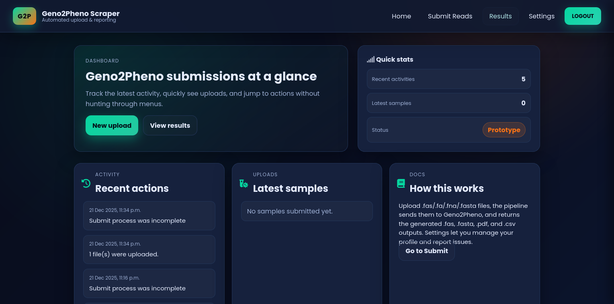
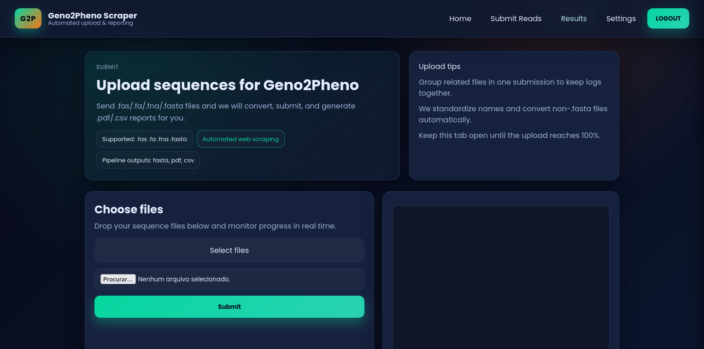
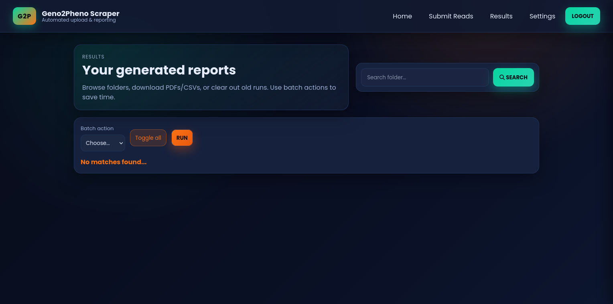
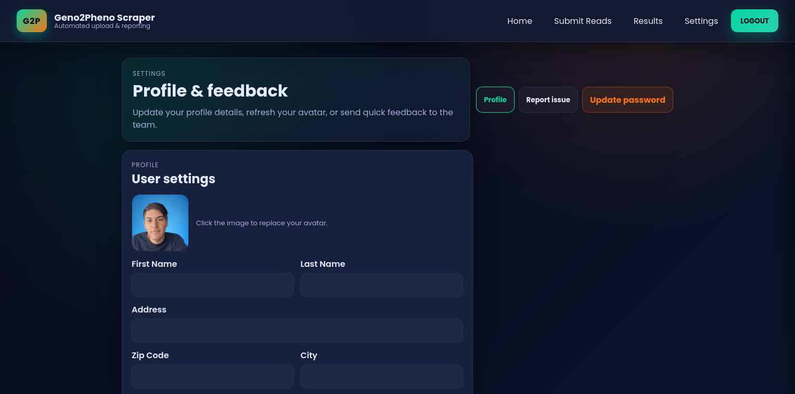

## G2P Web Scraper – Django UI

Modernized UI and upload portal for automating Geno2Pheno submissions, with screenshots and sample outputs ready for GitHub.

### What it does
- Upload `.fas`, `.fa`, `.fna`, or `.fasta` files; non-`.fasta` files are converted automatically.
- Submits sequences to Geno2Pheno, downloads resulting `.pdf`/`.csv` reports, and stores generated `.fas/.fasta`.
- Tracks user activity, samples, and lets users update profile info or report issues.

### Screenshots







### Sample outputs
- PDF: `docs/results/1.pdf`
- PDF: `docs/results/1.2.pdf`

### Getting started
1. Install dependencies in your virtualenv:
   ```bash
   pip install -U pip setuptools wheel
   pip install -r requirements.txt  # if present
   ```
2. Export the required paths (adjust to your machine):
   - `MEDIA_ROOT` – where uploads/results/pdfs are stored (default: `<project>/media`).
   - `GECKODRIVER_PATH` – path to `geckodriver`.
   - `TROPISMO_DIR` – directory that contains `pleres_sysgeno_recipiente.py` (external dependency).
3. Run Django:
   ```bash
   python manage.py migrate
   python manage.py runserver
   ```

### External dependencies
- Geno2Pheno scraping requires `geckodriver` and Firefox in headless mode.
- The script `project/scripts/hiv.py` expects `pleres_sysgeno_recipiente.py` inside `TROPISMO_DIR`. Provide that folder or override the env var.
- Some system packages may be needed for Selenium/PDF handling (e.g., Firefox, `freetype`/`libffi` depending on your distro).

### Project structure highlights
- `templates/account/` – redesigned pages (dashboard, submit, results, settings, auth flows).
- `static/css/` – new dark theme styles.
- `project/scripts/hiv.py` – submission + scraping pipeline.
- `docs/prints/` and `docs/results/` – screenshots and sample outputs tracked with the repo.

### Using the app
- **Submit**: upload sequence files, watch the live progress bar, and review logs.
- **Results**: browse folders, select files/folders, and run batch download/delete.
- **Settings**: update profile, avatar, and send quick feedback.

### Notes
- Email confirmation was disabled for uploads.
- If you see path errors, set `MEDIA_ROOT`, `GECKODRIVER_PATH`, and `TROPISMO_DIR` explicitly in your environment.
